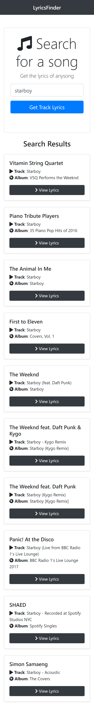

# Lyrics Finder

Lyrics Finder is to search lyrics of the song u search.

Link [👨‍💻](https://m-lyricsfinder.netlify.app/)

## Usage

Search name of a song and lyrics will appear in card.

## Resources used

- Create react app [🔗](https://reactjs.org/docs/create-a-new-react-app.html)
- MusixMatch API [🔗](https://developer.musixmatch.com/)
- Bootstrap [🔗](https://getbootstrap.com/)
- FontAwesome [🔗](https://fontawesome.com/)

## Learning

- Axios
- Context, useContext, useEffect

## License

[MIT](https://choosealicense.com/licenses/mit/)
